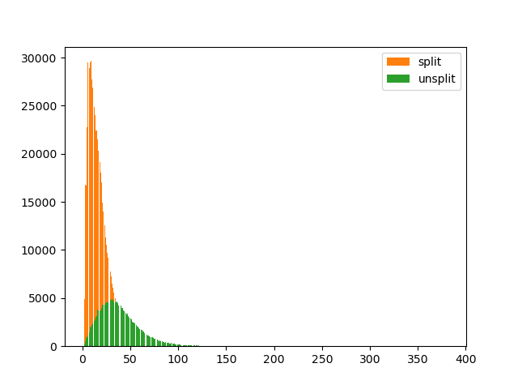
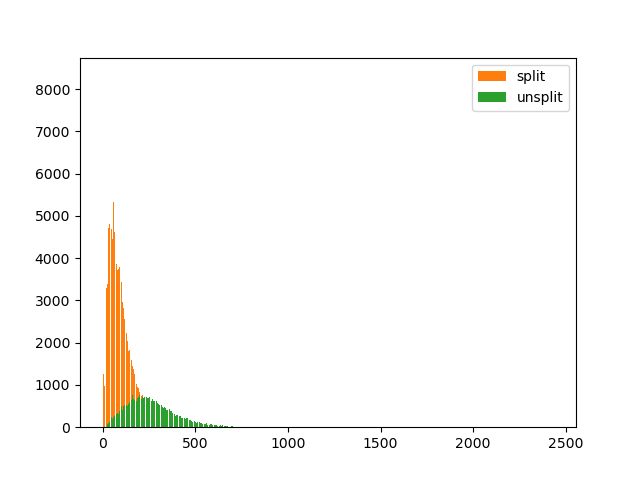

# December 15 

**Plans for today**

- run on test set
- start retraining vision models 
- write mimic dataloader (tonight)

## Test set observations

- some images do not load properly (corrupted maybe?) (TODO for Mars )
- To avoid this, see [this git issue](https://github.com/pytorch/pytorch/issues/1137)
- Just return None if exception happens and update collate fn

```python
def __getitem__(self, idx):
    try:
        img = cv2.imread(data[idx])
    except:
        return None
    return img

# ...

def collate_fn(batch):
    batch = list(filter(lambda x: x is not None, batch))
    return torch.utils.data.dataloader.default_collate(batch)
```


## Test Set Results

cstart

Task | Loss | Auroc | Auprc 
--- | --- | --- | --- 
**Atelectasis**|l1 | .617| .752
Atelectasis|l2 | .818| .880
Atelectasis|cosine | .808| .885


Task |Loss | Auroc | Auprc 
--- | --- | --- | --- 
**Cardiomegaly**|l1 | .367| .649
Cardiomegaly|l2 | .830| .933
Cardiomegaly|cosine | .706	| .853

cmid

Task |Loss | Auroc | Auprc 
--- | --- | --- | --- 
**Consolidation**|l1 | .733| .921
Consolidation|l2 | .462| .844
Consolidation|cosine | .731| .916


Task |Loss | Auroc | Auprc 
--- | --- | --- | --- 
**Edema**|l1 | .903| .937
Edema|l2 | .903| .941
Edema|cosine | .836| .886

cend

Task |Loss | Auroc | Auprc 
--- | --- | --- | --- 
**Pleural Eff.**|l1 | .885| .875
Pleural Eff.|l2 | .886| .873
Pleural Eff.|cosine | .854| .861


## Retraining Imaging Model: Notes

- Retrain imaging model on each task, with 1, 5, 10, 25, and 100% of data and new labels
- New lightning module: **EmbeddingXImagingModel**
- Lightning cannot checkpoint on val_auprc
	- figure out a hack when it matters
- Using data augmentation, should we fine tune with augmentation?
- Using pooled output for embedding
	- do not have to pad sequences


## Retraining Imaging Model: Results

- [Weights and Biases ](https://wandb.ai/djosephs/embeddingx/sweeps/suy6ri36)

Placeholder for table/figure


# Remarks: December 15

- Why is LR finder failing?
	- assumption is small percentages give it trouble, maybe best to find and log ideal lr with full dataset and log it and never run the lr finder
- Figure out checkpointing hack
- Do not have to pad sequences on BERT
- Should we be fine tuning with augmentation now?
- Getting a mysterious error with multi gpu, so just using one for now, fix tomorrow


# December 17 

- Met with Shirley today
- New direction: focus on chexpert tasks
- Review domain adaptation papers sent to us
- If poor results on chexpert tasks, adversarial or contrastive approach 
	- Probably contrastive
	- More domain adaptation review!
- Need to think of how to make this a more technical contribution
- Learning with noisy labels


# December 21/22

Plans:

- Get 1% of data full pipeline on the 5 chexpert tasks + no finding
	- Make sure to log per class auroc and auprc, dont worry about other metrics
	- Save not by loss but by auprc
- Finalize literature review on sheets
- Put any notes here
- Time allowing: Clean up discovery

Notes:

- We have interesting case of noisy labels where they are just sometimes missing


## Fixing pipeline: per class metrics

Proper per class metrics for non full task classification, and saving by auprc

```python
def evaluate_generator(metric, name):
    def result(true, probs, tasks, split):
	scores = undefined_catcher(metric, np.vstack(true), np.vstack(probs), average=None)
        tasks = [f"{split}_{task}_{name}" for task in tasks]
        scores_dict = dict(zip(tasks, list(scores)))
        scores_dict[f"{split}_{name}"] = scores.mean()
        return scores_dict
    return result

evaluate_auroc = evaluate_generator(sk_metrics.roc_auc_score, "auroc")
evaluate_auprc = evaluate_generator(sk_metrics.average_precision_score, "auprc")

# usage
auroc_dict = util.evaluate_auroc(val_true, val_probs, self.tasks, "val")
auprc_dict = util.evaluate_auprc(val_true, val_probs, self.tasks, "val")
```

## Pipeline: BERT 1%

https://wandb.ai/djosephs/embeddingx/runs/1rd0dksu

- command: `./run.sh -l config/train_nlp.sh`
- stdout logged to: `train_nlp.log`
- Weights saved at `/data/embeddingx/ckpts/medical_bert/iter_2/all/0/0.01/0.601`
	- TODO: update weight saving so i dont have to sort through timestamps in this script
- Might consider switching to 5%


## Pipeline: BERT 1% results

- **val auroc**: 0.707
- **val_auprc**: 0.601
- **step**: 87
- TODO: rerun on 5% after this set of runs finishes


## Pipeline: Distance minimization  1%

https://wandb.ai/djosephs/embeddingx/sweeps/deo0pf2a

- command: `./run.sh -l config/joint_sim_frozen_bert.yaml` update with bert weights first
- stdout logged to: `joint_sim_frozen_bert.log`
- Results stored in :

```python
filepath = f"{args.weights_save_path}/new_bert_embedding/{args.similarity_metric}/{args.task}/classifier_test/"
```
- TODO: update where they are stored


## Pipeline: Distance minimization results  %


Loss_fn | Val Auroc | Val Auprc | Val Loss | Train Loss
 --- | --- | --- | --- | ---
l1 | .522| .367 | .352 | .291
l2 | .582 | .4  | 13.45 | 11.55
cosine | .485 | .345  | .322 | .211


## Pipeline: Fine tune 1%

https://wandb.ai/djosephs/embeddingx/sweeps/opapysq5
try2: https://wandb.ai/djosephs/embeddingx/sweeps/3c99yw8h

- command: `./run.sh -l config/fine_tune_base.yaml`
- Data augmentation this time
- stdout logged to: `fine_tune_base.log`

## Pipeline: Finetune results 1%

NOTE: rerunning currently with different LR to verify it is this bad


Loss_fn | Val Auroc | Val Auprc | Train Auroc | Train Auprc
 --- | --- | --- | ---| ---
l1 | .468| .31 | .479 | .246
l2 | .5 | .3507 |.493 | .2527
cosine | .5902 | .438  | .488 | .254

## Pipeline: notes

Need to debug lr finder

We can train BERT AND a fine tune model at the same time, more efficiency in iterative runs

## Pipeline: 10%

[Worse performance on 5% of data for BERT](https://wandb.ai/djosephs/embeddingx/runs/243wehbl?workspace=user-djosephs) -> [try 10%](https://wandb.ai/djosephs/embeddingx/runs/1v8wie8q?workspace=user-djosephs)


## Worries and thoughts

- Assumptions were made when we were getting 100% on the NLP labels, this is not the case
	- We have a break from deadlines, maybe instead we just try some experiments on new approaches during this relatively free time
	- We have a robust enough lit review we can try other things
- It feels like we are allowing the problem to get too big
	- We are trying to solve both data modality problem and domain shift problem in one go, this is too hard!


## Solution: Reframing???

- Just break it into two problems: 
	- **A**: Multimodal Learning, ALL within NLP labels
		- Here our assumptions for our existing work are **completely valid**
		- Verify on some ML datasets -> at least a workshop paper, potentially conference
	- **B**: Domain adaptation across both label types maybe in just computer vision
		- Publish as clinical paper 
	- **C**: Bonus: show they work in conjunction, maybe as another paper as well, at least arxiv, maybe workshop somewhere


## Lit review

- Loss based methods focus on softmax classification and binary classification, I am not sure how they extend to our multilabel scenario
	- I do not have the math background yet
- We have an interesting case where labels AND sometimes information is missing from the training data.
- I think we should therefore focus on how we can use our validation dataset (or some other subset of physician labels) to regularize our training.
- Two key approaches:
	- [Bilevel optimization (ECCV 2018 (30))](http://openaccess.thecvf.com/content_ECCV_2018/papers/Simon_Jenni_Deep_Bilevel_Learning_ECCV_2018_paper.pdf)
	- [SOSOLETO (ICLR 2019 best paper)(4)](https://arxiv.org/abs/1805.09622)
- I really like Shirley's citation format with the [CONFERENCE YEAR] (Citations), we should use this

# December 23

## Pipeline: 10%

Results not as promising as hoped, and due to time constraints going to focus on 1% with NLP labels (gives us promising comparision)

## Pipeline: 1%, NLP labels

- Add `labels` flag, 
	- labels = `md` = physician labels
	- labels = `nlp` = nlp labels
- [NLP training](https://wandb.ai/djosephs/embeddingx/runs/1wyfzpfj)
- [Distance Minimization]()


## NOTES

1% training value counts

```
 {'Cardiomegaly': Counter({0.0: 795, 1.0: 142}), 'Atelectasis': Counter({0.0: 711, 1.0: 226}), 'No Finding': Counter({0.0: 764, 1.0: 173}), 'Consolidation': Counter({0.0: 880, 1.0: 57}), 'Pleural Effusion': Counter({1.0: 4       76, 0.0: 461}), 'Edema': Counter({0.0: 589, 1.0: 348})}
```

Valid

```
{'Cardiomegaly': Counter({0.0: 97, 1.0: 9}), 'Atelectasis': Counter({0.0: 79, 1.0: 27}), 'No Finding': Counter({0.0: 71, 1.0: 35}), 'Consolidation': Counter({0.0: 100, 1.0: 6}), 'Pleural Effusion': Counter({0.0: 71, 1.0:        35}), 'Edema': Counter({0.0: 79, 1.0: 27})
```

# December 28

TODO: loading text and simple stats, lit review begin

## Loading text

* After reading, splitting up doesnt make sense to me, discuss with Mars
* Currently splitting by `1.` etc, will figure out what makes more sense this evening
* Pandas way slow for troubleshooting this, using csv dictreader instead for now

```python
def csv_to_dict(f: str) -> Dict[Any, Any]:
    # significantly faster than pandas
    reader = csv.DictReader(open(f))
    out = {}
    for row in tqdm.tqdm(reader, desc=f"reading {f}"):
        for column, value in row.items():
            out.setdefault(column, []).append(value)
    return out
```

## Loading Text: splitting

Add flag for if we want to split into subsentences or not

```python
def load_captions(csv_path: str=CHEXPERT_RAD_CSV, split:bool=True)-> List[str]:
    captions_raw = csv_to_dict(csv_path)["Report Impression"]
    if not split:
        cleaner = re.compile('[\W_\d+\s\d+\.\d+]+', re.UNICODE)
        captions = [re.sub(cleaner, ' ', t).strip() for t in tqdm.tqdm(captions_raw, desc="cleaning")]
        return captions
    else:
        cleaner = re.compile('[\n\s+]')
        captions = [re.sub(cleaner, ' ', t).strip() for t in captions_raw]
        splitter = re.compile('[0-9]+\.')
        captions = [re.sub(r'[^\w\s]',"",item) for items in tqdm.tqdm([splitter.split(x) for x in captions], desc = "splitting and cleaning") for item in items]
        captions = [x for x in captions if x != "" and len(x) > 1]
        return captions
```

## Loading Text: Summary statistics: Word level

- Approximately 2.7 bullet points per report
- Approximately 75 words per bullet point
- Approximately 120 words per report



## Loading Text: Summary statistics: Letter Level


## Loading Text: Questions for Mars/Shirley

- it looks like splitting at number followed by period works, please verify
- what sort of cleanup do we need to do?? I am not too comfortable

## Lit review: net2net

This does not feel appropriate for our problem, idea is to translate between two pretrained nets, our goal is instead to pretrain a language model, so even though it is SOTA it is not really making much sense

## Lit review: Question

Should we use sentence bert? Why not just train sentence bert on sentence bert tasks on our data? (This seems like a reviewer question)

- Can frame as we want to learn features that are useful with image model (visiolinguistic features)


## Lit review: potentially stupid (but invasive) thought

In [this paper](https://arxiv.org/pdf/1511.02793.pdf) and [several other citing papers](https://scholar.google.com/scholar?cites=13416680903946375913&as_sdt=5,44&sciodt=0,44&hl=en), an autoregressive model is used to generate images from text, and [ImageBert](https://arxiv.org/abs/2001.07966) treats images just the same as a language (make them into 1D vectors), could we do something similar to pretrain our language model? For example treat it as a translation problem or something along these lines?

## Lit review: attgan/controlgan

Same basic underlying principle for these guys, use attention to highlight key phrases and draw them on the image,  the big difference is how we build our loss (outside of normal discriminative stuff). Attgan uses in essence a retrieval task on the embeddings as an objective function, along with a few different resolutions of GAN loss, while controlgan uses a perceptual loss using a pretrained vgg-16 model instead of the retrieval task. Attention gan feels spiritually closer to what we are trying to accomplish.

## Lit review: DF-GAN

The idea here is to address some of the problems in other generative work, involving several discriminative models. Instead of using that, they introduce a penalty on the loss function to center the gradients on real images, which helps the generator converge better. I think one source of novelty for us may be to combine the attention ideas with a similar loss function.

## Lit review: worries

I think one worry focusing on SOTA GAN stuff is that their end goal is to make images and ours is just to pretrain the language model, we dont necessarily care about making high quality images, I think it might be ok to just get a simple GAN that we can debug easily up quickly so we have a win for Serena
